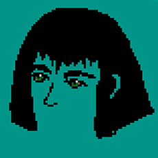

# About me

I'm Camila Simsiroglu, but most people call me Simsi. I am a visual artist from Buenos Aires living in Barcelona. I specialize in 3D art, and I print most of my designs in resin to make sculptures. Sometimes, I cast them in metal.  

I enjoy illustrating, and I consider it my strongest skill when it comes to sketching. I get inspired by animals, castles, natural scenery and also by musical instruments.  

I have experience with experimental lutherie; I’ve constructed both digital and analog instruments using digital fabrication techniques.

Follow through as I share my journey c;

### 🖼️ Image

### ✍️ Text
Some text that appears next to the image.

