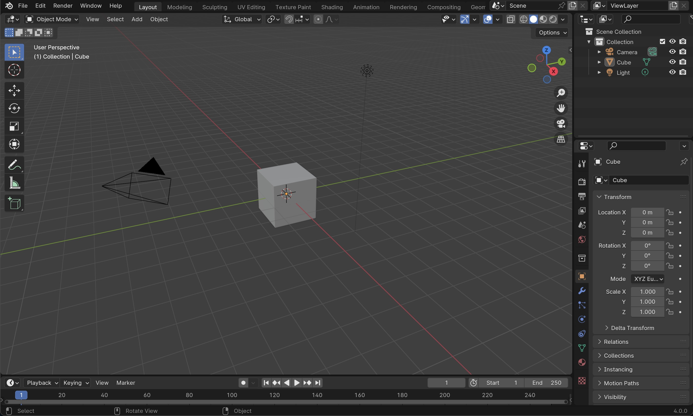

# Getting Started

 
★ ★ ★ Blender Studio & I ★ ★ ★

My journey with [Blender](https://studio.blender.org/welcome/) spans over five years of self-learning. It’s all about losing the fear of not knowing how something works, of messing things up, and of not knowing how to reproduce something you just did. 

<small>Doing is learning, and mistakes are part of the process. Feeling stupid is how you know you are learning.
</small>

I’ve discovered that the **best way to learn is to dive in with an idea in mind**. There are a million ways to do the same thing. 

Here, I want to share **how I learned to do the things I do**, my personal tricks, and what I’ve discovered along the way, so you can take inspiration and find your own path in Blender.

---

## First Impressions

So you've just managed to download Blender, open it and this is what you see. 

The main areas you’ll notice are:

- **3D Viewport**: this is the big central space where you’ll do most of your work — modeling, moving things around, sculpting, and so on.

- **Properties Panel**: on the right side, this is where you control details of your objects, materials, modifiers, and rendering. Think of it as the “settings hub.”

- **Outliner**: usually on the top right, this shows a list of all the objects in your scene. If the 3D Viewport is the stage, the Outliner is the backstage list of all the props.

- **Timeline**: at the bottom, this is mainly for animation, but even if you’re not animating, it’s good to know it exists.

---

## Navigation in the 3D Viewport

Before anything, you need to get comfortable moving around.

Orbit: rotate the view around your objects. (Middle mouse button drag)

Pan: slide the view left, right, up, or down. (Shift + middle mouse button)

Zoom: move closer or further away. (Scroll wheel or Ctrl + middle mouse drag)

---

## Moving Things Around

Selecting objects

<code>Left click</code> an object to select it (it highlights in orange).

<code>Shift + Left click</code> to select multiple objects.

<code>A</code> selects all objects in the scene.

## Moving objects

Press <code>G</code> (for “grab”), then move your mouse.

Press <code>X</code>, <code>Y</code>, or <code>Z</code> to lock movement to that axis.

---

## Gizmo

The gizmo (red, green, blue arrows) lets you move objects along a single **axis** by dragging the arrow.

To change your view, use the navigation widget (top right of the viewport) or press:

<code>1</code> = front

<code>3</code> = right

<code>7</code> = top

Add <code>Ctrl</code> for the opposite view.

---

## Creating Default Files 

When you open Blender, you can set up your scene once and save it as your default startup file.

This is important to us because using the right units keeps your models consistent and accurate, especially if you’re preparing them for 3D printing or fabrication.

To set up our file dor 3D printing go to **Properties → Scene → Units** and choose **Metric**, change to **centimeters** length and set up your **Unit Scale to 0.1**.

To make the grid more useful for precise modeling, you can change its scale.

Go to **Viewport Overlays → Guides → Scale** and set it to **0.01**. 

This is the basic setup. To make Blender remember it, go to
<code>File → Defaults → Save Startup File</code>.

Now, every time you open Blender, your scene will start with these settings already in place.

