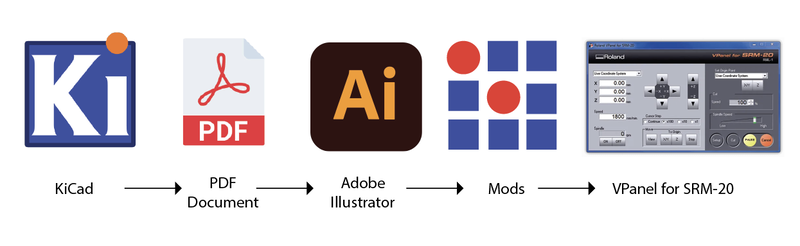
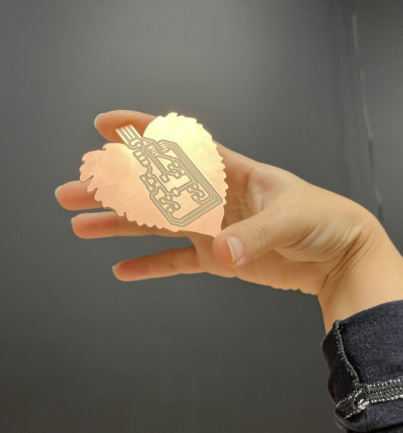
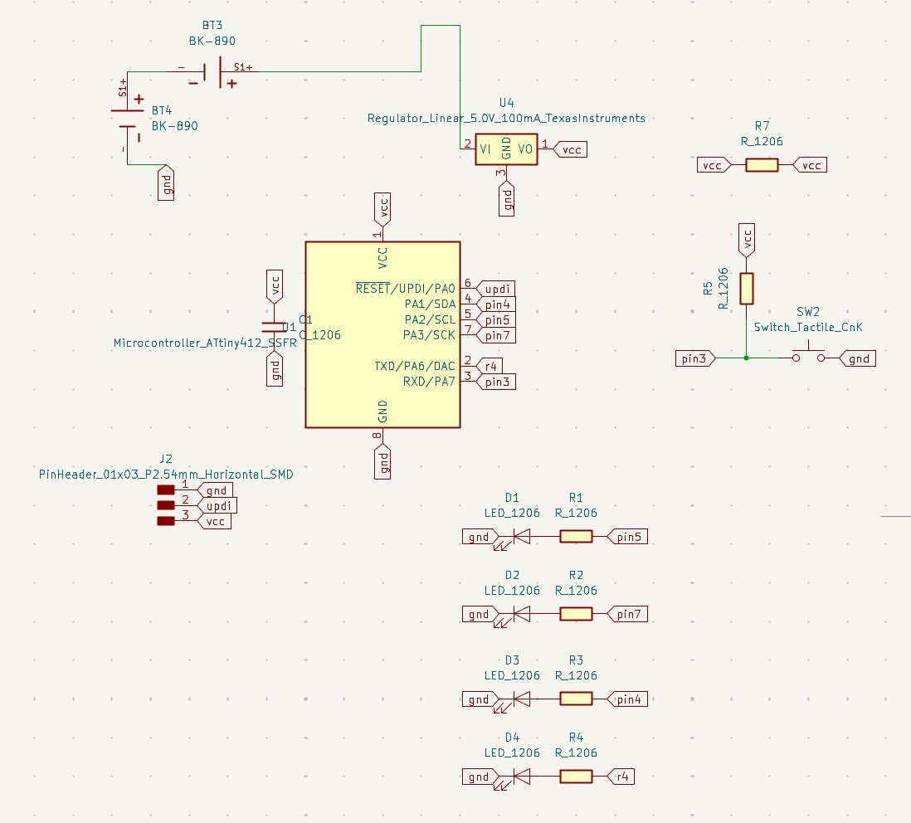
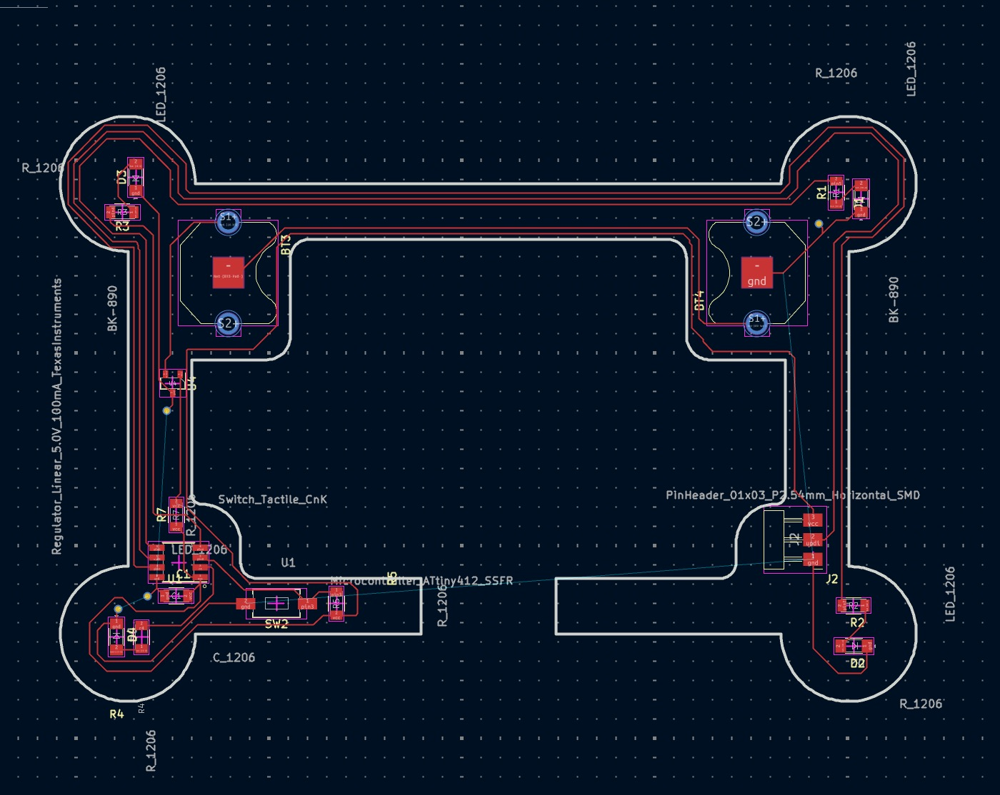
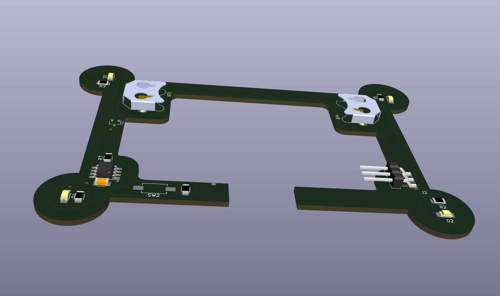
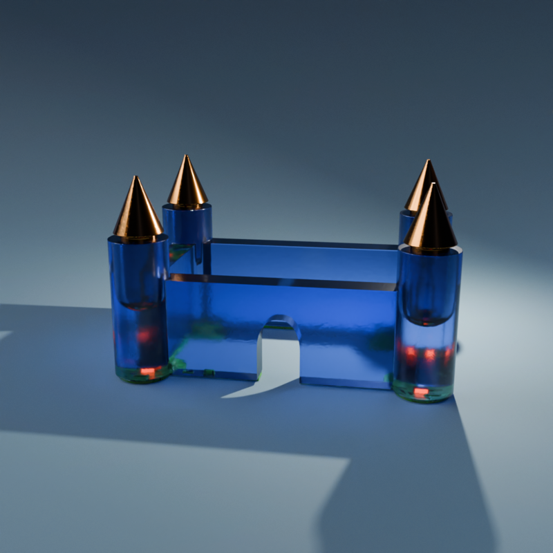

# Introduction

 
★ ★ ★ Making our board real ★ ★ ★

 

OK! Its time to make some dreams come true.

At our local lab we have a [Lunyee 3018](https://amazon.com/-/es/3018-Enrutadora-Totalmente-Interruptores-Emergencia/dp/B0CHM481NS/ref=sr_1_1?adgrpid=158260334600&dib=eyJ2IjoiMSJ9.EeC84FRlGlkOER9DGI-MtUqJqiMLJYqCk-1K7mYmnwEovg5cAqddM6fhxqM9AHTIc9DQ0UuGltHb1STllJSeqpNVVlDIq2JpWm4fvx99WHc79KZ73kBGLQCdv1ei_XpxnmECg81lxlRVDktFqhOsOGeawUm-ZW01TFIaDP1o59KkeaAqcqOuKIDZg_TppqUcbZar1ILyIyqiy8SZmyJ4A0VJ6SCGqQ3wTu_jbU3Tm2WmAgtznmkcehCdF4jJUMh9Uv5W34hdONe4Cbh_5WVWBPREKPAuU_2uARctr7JXEhk.qCSIZYFU5EMusF4kAdlpvD-int0vIzPh89JrxpZU0wA&dib_tag=se&hvadid=681431851856&hvdev=c&hvlocphy=9186399&hvnetw=g&hvqmt=e&hvrand=12710956167893822545&hvtargid=kwd-2281157484880&hydadcr=15946_13707437&keywords=lunyee+3018+pro+ultra+cnc+machine&mcid=0f8a4cdc50ed3731893f776521145193&qid=1778099683&sr=8-1) milling machine that works well with UGS*
   Universal Gcode Sender
 in order to take instructions.

Esentially, the workflow of this process looks like this:

<small> Looks tricky, but it's actually not. Lets go over it with more detail. </small>

## Preparing the File

I'll be using the board I created on [Week 6](https://fabacademy.org/2025/labs/barcelona/students/camila-simsiroglu/assignments/week%206.html) and an outline from a vector leaf I created.

Go to **Kicad**, and in the PCB editor and click on Print > Print > PDF and name the file and the folder you want to save it in. 

    
       

Here you can select what information you want to export. In our case we will be exporting only the Front Copper because I will be creating the outline on Illustrator.

    
       

This will create a PDF file with the information you need to mill. Ideally, this is what we are aiming for:

    
    
        

 

Open this in your favourite vector software, as I said, I'll be using Adobe Illustrator. Ok, the process was a little tricky on this software but here is how I made it work.

I started out with this vectorized image and added a colored background to makes things clearer.

Then, I chose Object > Expand everything over everything.

  
       

 

Now go over to the Window tab and open the Pathfinder.

     

 

First, click on the second option of the Pathfinder. Then click on the Unite option of the Shape Mode.

     
       

 

And Voilà :D You can now change the color of your outlines to get an inverted PNG that looks like this!

     

 
Here is the outline:

     

 

Cool!
So... what's next? 
Oh yes! The mods! But wait. **What is a "Mods"?** 

Mods is a browser-based, open-source tool that **converts PCB designs into milling toolpaths**. Much like a slicer for CNC machines or 3D printers. It customizes workflows, supports various machines (like the Roland SRM-20), and requires no installation. 

Go to the [website](https://modsproject.org/), right click > program > open program > select your machine (Roland, milling PCB).

    
     
     

 
You should be looking at something like this:

     

 

Now load your .png, I'll be starting with the traces. Remember to export it with **1000.dpi** resolution. Go to **set PCB defaults** and click on **Mill Traces**, which is what we are going to to first (Mill Outline otherwise). 

You should be looking at something like this:

     

 

Now you should see some default settings here at **mill raster**:

     

 

When you are tracing, set your **cut depth** and **max depths** to 0.15 mm <small>(holy precision)</small>. When outlining, leave these settings on default.

Enable your **edit delete** outputs and set your **milling machine** **speed** to 2 and your **X**,**Y** and **Z** values to 0 (This goes aswell in the outline and drill options).

     
     

 

Now click on **calculate** and this will create a cut file for your SRM-20 MonoLab software.

## Cutting

Head over to the Roland machine and use the Vpanel for SRM-20. First up, place your mill in the machine. At our lab we have **1/64 (tracing)** and **1/32(outline and holes)** in size. 

Pick your weapon (tracing first) and insert it in the **clamping collect**. Inside the Roland you'll find an Allen tool to adjust your mill. Leave a 3-5mm distance above the plate.

Place your copper board on the cutting base and fix it by using some **double-side tape** on the bottom of your board. Make sure there are no wrinkles.

This is how the software looks like.

     

 

Move the X and Y position to the bottom left of your copper board. 

     

 

Set this coordinates as your **X and Y origin**.

     

 

Now release the clamping screw and manually guide the endmill down to the place. Then retighten the screw and set it as the **origin of your Z**.

     

 

Load your files by clicking on **Cut**, and then select **Output** to the have the Roland rolling. <small>Ha!</small> 

     

 

This is how my board came out!

Yipiiii!!....? Actually, no time to celebrate. I had mistakes that forced me to make a **new design**. Clearence wasn't big enough and the mill could not go through certain places. Also, the outline shape wouldn't allow the USB to go plug in properly.

     

 

... (╯°□°）╯︵ ┻━┻    
  
<small>Back to the drawing board. </small>

*What* went wrong, and *how* can I learn from this?

For starters, I mentioned **clearence**. In PCB design, clearence refers to the **minimum spacing** between conductive elements*
  (e.g., traces, pads, vias
 to prevent short circuits and ensure proper insulation. 
To set this on KiCad, go to your PCB Editor > File > Board Setup > Net Classes.

     

 

     

 

I chose 0.4mm because since I’m using a **1/64-inch (≈0.4mm)** end mill for traces, setting this clearence ensures that the milling tool can accurately carve out the spaces between traces without unintended overlaps or cutting errors. 

With this setup, production should go smoothly. 

This time, I’m designing a **portable version of my board** while keeping the same components: 4 LEDs, 4 resistors, 1 capacitor, an ATtiny412, a UPDI for programming, and a switch button. However, instead of a standard power supply, I’ll be using **two 3V button batteries**. 

To make this work, I need a **[transistor](https://www.ti.com/lit/ds/symlink/lm3480.pdf)** to regulate the voltage from 6V down to 5V, ensuring it’s within the ATtiny412’s operating range. Also, I’ll include two [coin cell holder](https://www.memoryprotectiondevices.com/datasheets/BK-890/BK-890-datasheet.pdf) I found in the lab to secure the batteries in place.

This is how my schematic turned out. 

As promissed during week 6, I picked a *funny shape* for the outline, forcing my connections -or wiring- to get a little weird. 

The goal is to assemble the PCB into a resin sculpture, so I exported the 3D model from KiCad into Blender to see how it would turn out. 

Beautiful (๑>ᴗ<๑). 

You can see how this project progressed as I continue it throught [week 9](https://fabacademy.org/2025/labs/barcelona/students/camila-simsiroglu/assignments/week%209.html) and see its results [week 10](https://fabacademy.org/2025/labs/barcelona/students/camila-simsiroglu/assignments/week%2010.html).

