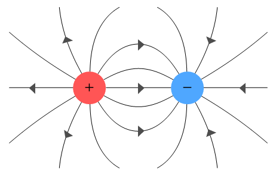
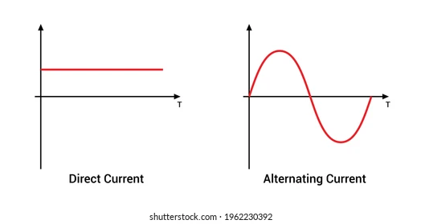

# Electronic Design

 
★ ★ ★ Circuits ★ ★ ★

 

This section focuses on electronic design, covering **schematic creation**, **PCB layout**, and basic **circuit concepts**. The goal is to design and produce a functional circuit using [KiCad](https://www.kicad.org/download/), incorporating essential components like microcontrollers, switches, and LEDs while getting acquainted with the workflow.

 
<small> ha! easy peasy!</small> 
 
૮ ⚆ﻌ⚆ა                     (๏ᆺ๏υ)
 
<small>...?</small>

---

## Electronics

I've been introduced to this topic countless times, but unfortunately, little has stuck with me. So I'm decided to make this one count! 

I gathered a lot of information from a documentation [forum](https://fablabbcn-projects.gitlab.io/learning/educational-docs/fabacademy/classes/06-ElectronicsDesign/) and [this discussion](https://news.ycombinator.com/item?id=16775744), which highlighted the importance of **devoloping intuition**.

This has been my approach—the Beta approach, I hope. 

## Basic Electrical Concepts

**Charge** is the fundamental property of subatomic particles. Protons are positive, electrons are negative, and neutrons are neutral. Atoms, which make up all elements, consist of a core with protons and neutrons, while electrons orbit around them.

**Voltage** is created when electrons are unevenly distributed, causing a potential difference. It is **measured in Volts (V)** and determines the energy applied per unit charge*
  (E = V × Charge)
 . This imbalance drives current flow as electrons move to restore equilibrium.

**Current** refers to the flow of electrons due to voltage difference and is **measured in Amperes (A)**. 

A **direct current* DC
** flows consistently in one direction. 

An **alternating current* AC
** changes direction over time.

**Resistance** determines how easily electrons can flow and is **measured in Ohms, Ω**. High resistance limits current flow, while low resistance allows high current, which can cause a short circuit if too low.

**Ohm’s Law** describes the relationship between voltage (V), current (I), and resistance (R):

𝑉 = 𝐼 × 𝑅

<small> I covered this in [FabAcademy program: week 4](https://fabacademy.org/2025/labs/barcelona/students/camila-simsiroglu/assignments/week%204.html) ;) </small>

---

## The Multimeter & Breadboard

A multimeter is a tool that measures voltage, resistance, and current in a circuit. It is also useful for debugging by checking continuity between points.

A breadboard is a prototyping tool that allows easy and quick connections between electronic components, enabling fast circuit assembly and testing.

I usually test my circuit diagrams using wires and a breadboard before taking it to the PCB. 

---
## Electronic Design { style="text-align:center" }

In the world of electronics, designing circuits and systems requires a deep understanding of various components and how they work together. So we are going to start by describing the most basic ones and showcasing how they look on a schematic.

## Electronic components

- **Resistors**: Passive two-terminal electrical component that implements electrical resistance as a circuit element.

- **Capacitor**: A device that stores electrical energy in an electric field. It is a passive electronic component with two terminals. Its *main job* is to supress high frequency noise in power supply signals.

- **Diodes** (asymmetric conductunce): Two terminal component that conducts current primarly in one direction. It has low resistance in one direction, and high resistance in the other.

- **Oscillator**: Electronic circuit that produces a periodic, oscillating electronic signal, often a sine wave or a square wave or a triangle.

- **Regulator**: A DC linear voltage regulator that can regulate the output voltge even when the supply voltage is very colse to the output voltage.

- **Transistor**: A switch that allows more voltage to be integrated to the circuit. Example; you want to control a light with a microprocessor.

 

All of these components have specific numerical values and units that are tied to their functions. To ensure they work correctly within an integrated circuit, it's essential to calculate their values based on the requirements of your design. This information can be found in their respective **datasheets**, which provide crucial details on their specifications, operating conditions, and limitations.

--- 

## Electronic Design Automation

EDA* Electronic Design Automation
 tools help design and simulate electronic circuits. I use [KiCad](https://www.kicad.org/), a powerful open-source tool for schematic creation and PCB layout.

The design process involves several key concepts:

- **Symbols**: These are graphical representations of electronic components (such as resistors, capacitors, diodes, etc.) used in the schematic diagram. 

- **Footprints**: A footprint refers to the physical layout of a component on the PCB, defining the size and shape of pads, holes, and the component’s positioning on the board. It serves as the actual placement of the component when soldered onto the PCB.

- **PCB** (Printed Circuit Board): A PCB is the physical board that holds and connects the components in an electronic circuit. It is made of layers of conductive material (usually copper) and insulating material (such as fiberglass). 

The PCB is where all the electrical connections between components are routed. 

---

## ꩜꩜꩜ Designing my first board ꩜꩜꩜

While I was learning this, I set out to design my very first board, completely on my own. While I've worked on other electronics projects in the past, like a MIDI controller, I always hit a wall when it came to diving into professional PCB design. 

To avoid getting overly ambitious or overconfident, I decided to take a more humble approach. Baby steps, really. Because sometimes learning involves feeling a little "dumb" as you work through the process. 

With that mindset, I opted to design a very simple board: **a basic circuit with a button, four LEDs, and an ATtiny microcontroller**. I used resistors for the LEDs, a capacitor, a USB-A for power, and a UPDI for programming. A straightforward design to get my feet wet and build a solid foundation.

### Requirements 

So what do I need? Or how do I know what I need? 

Well if you know anything about me, you might have noticed I tend to like small things. I studied a bunch of MCUs* Microcontroller , including the Attiny.

The Attiny family is great for small compact designs.

OK! ᕙ(⇀‸↼‶)ᕗ <small> Hands on! </small>

I opened up KiCad, created a New Project, and went over to the Schematic editor.

Then I opened up the tab Preferences> Manage Symbol Libraries.

And there I clicked on the **+** icon to add the [zip folder](https://gitlab.fabcloud.org/pub/libraries/electronics/kicad) containg all the components we had at the local Lab where I worked on this (FabLab Barcelona). I also deactivated all the other presets loaded by KiCad so that I don't accidentally choose the symbol of a component to which I don't have access. 

Once this was done I used the command <code>A</code> to click anywhere in the canvas and so the list of symbols appeared. 

I chose the **Attiny 412**. Below the list you can see some useful information, including a [link to the datasheet](https://ww1.microchip.com/downloads/en/DeviceDoc/40001911A.pdf). This is where I confirmed that **this MCU can handle 5V**, so using a USB Type-A(5V) power supply would check out perfectly.

I procedeed to add that component in the same way, then the rest of the components came and my schematic looked like this:

Lets go over my train of thoughts to understand the choices I made - why included certain components and left others out...

The Attiny 412 has **eight pins**. Out of these, one is VCC and one is GND, leaving me with six usable pins. The power source? USB. That takes care of two pins. Since **USB power** can introduce noise, I decided to smooth it out with a capacitor. To determine the right value, I consulted ChatGPT, which suggested using a **10 µF capacitor**. I also cross-checked this with other documentation and found a [project](https://fabacademy.org/2023/labs/isafjordur/students/svavar-konradsson/projects/t412.html#neils-board) that used the same capacitor, so I went with it.

Next, how will the board receive instructions? One option would be to use the USB data pins, but that would require two pins. Instead, I opted for **UPDI** (Unified Program and Debug Interface), which only needs one data pin connected to the board, plus VCC and GND.

What about a **transistor? Not needed!** as I confirmed earlier, the Attiny 412 can handle 5V directly.

I also wanted a **switch** to control the LEDs, so I assigned a pin for that. To prevent signal noise, I added a **pull-up resistor**.

At this point, I had four pins left for the LEDs ([this](https://download.luminus.com/datasheets/Luminus_MP3014_1100_Datasheet.pdf) ones I liked the most), each requiring a resistor. 

According to the electrical characteristics, the LEDs have a typical forward voltage of 2.85V. Meaning the resistor needs to handle the remaining voltage from the 5V supply. I chose 100Ω resistors since they are easier to find, and they limit the current to a safe level, keeping the LEDs well within their recommended operating range.
 
​
<small>
Great. Now I know every thing I wanted to place. 
</small>

You might have noticed that the symbols have labels on them to the side. This is to indicate their connections and you can find this tool the right panel. 

Once you know how to connect your components it's time for the fun part; **wiring**!!
Head over to the **PCB Editor** by clicking on this icon on the top right.

You might see an empty canvas so update your schematic using this icon on the top right.

Now all I needed to do is wire it up! Make a layer of copper connections and some tracing by hand. Sort of like building a maze and at the same time trying to find your way out of it.
This is how my board came out after an hour of wiring.

You can also add a layer for the **outline** of your board. But for the moment, I’ll just stick with a boring square and save the funny shapes for later.

Btw, this is a **3D model** of the board. 

You can access it by clicking on this Icon at the top right of the PCB editor.

You can also import it to your favourite 3D software and place it on your designs! Cool huh? 
 
---

I'll be exploring how to create boards in real life in the next section. So stay 
*grounded* and tuned for more. 

<small> Ps: you can access my design files [here](../../images/documentation/pcb-manufacturing/Electronics-design/sims-board.zip).</small>
