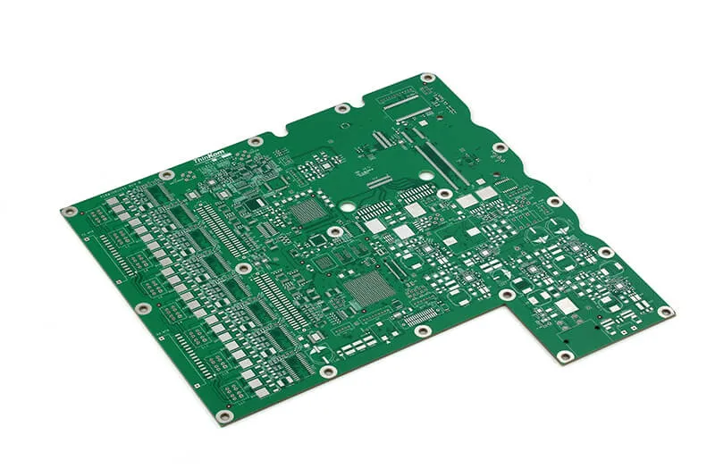
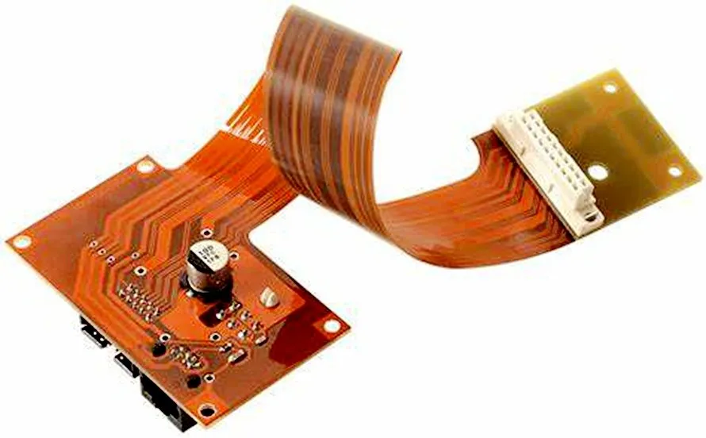
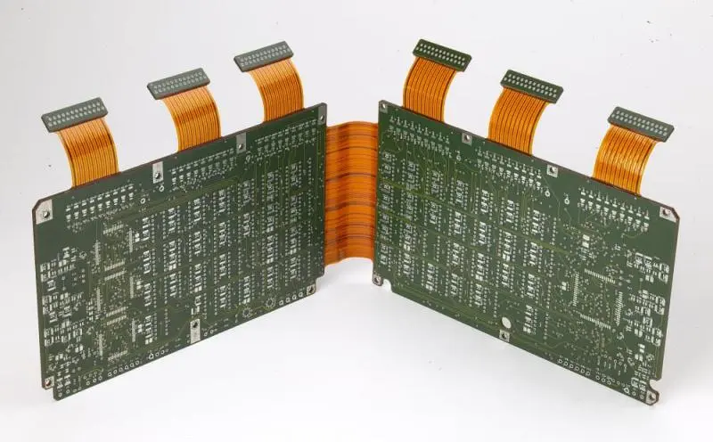
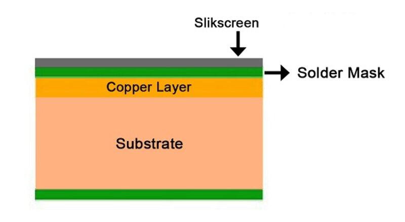
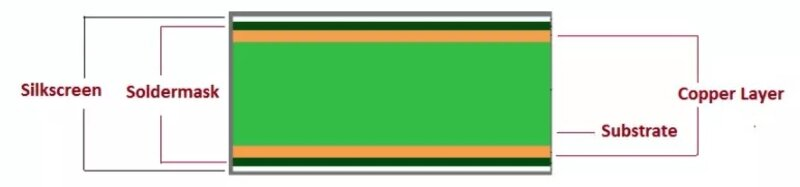
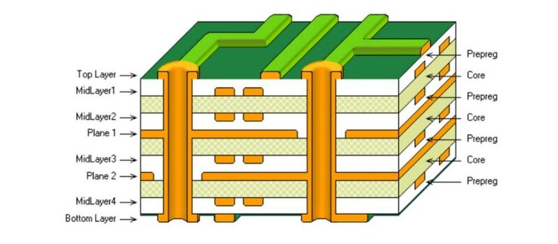

# Introduction

 
★ ★ ★ Electronic Production ★ ★ ★

 

Hey! In this section we will be expolring different methods of PCB manufacturing like milling, while we gain hands-on experience with the tools and techniques required to make high quality printed circuit boards.

This is an essential step in the journey of digital fabrication, as it allows us to bring our circuit board designs to life.

---

## Types of PCBs

A PCB*
   Printed Circuit Board
 is the [foundation](https://fabacademy.org/2025/labs/barcelona/students/camila-simsiroglu/assignments/week%206.html) of most electronic devices, providing mechanical support and electrical connections for various components. PCBs come in different types depending on their construction and flexibility:

- **Rigid PCBs**: Most common type, made from solid substrates like fiberglass. 

- **Flexible PCBs**: Made from flexible plastic substrates, allowing them to bend and fit into compact spaces, making them ideal for wearable and compact electronics.

- **Rigid-Flex PCBs**: A combination of both rigid and flexible materials, these PCBs provide structural integrity while maintaining flexibility in certain areas.

In addition to flexibility, PCBs are categorized based on the **number of layers** and their complexity:

- **Single-Sided PCBs**: The simplest type, with conductive tracks on only one side of the board.

- **Double-Sided PCBs**: Have conductive layers on both sides, allowing for more complex circuits and component placement.

- **Multilayer PCBs**: Consist of multiple layers of conductive material, separated by insulating layers. These are used in high-performance applications like computers and communication devices.

---

## Design Rules & Electrical Connections

When designing a PCB, there are several important design rules to consider to ensure proper functionality and manufacturability:

- **Electrical Conductor Spacing** (Clearance): The minimum distance between conductive traces to prevent short circuits.

- **Trace Width**: The thickness of conductive paths, which must be sufficient to handle the expected current without overheating.

- **Via and Pad Size**: Vias are small holes that connect different layers of a PCB, and pads are the areas where components are soldered. Proper sizing is crucial for good connectivity.

- **Grounding and Power Distribution**: A well-planned ground plane and power routing help minimize noise and improve circuit stability.

---
## Fabrication Methods { style="text-align:center" }
The are **two common fabrication techniques** to manufacture a PCB: Etching and Milling. 

## Etching

[This process](https://www.instructables.com/Make-a-Circuit-Board-With-Household-Goods/) involves removing unwanted copper from a copper-clad board using a chemical solution, typically ferric chloride or ammonium persulfate. The steps include:

1. Printing the Circuit Design onto a special film or transferring it onto the copper board using toner transfer.
2. Etching the Board by immersing it in an etching solution to remove the unprotected copper.
3. Drilling Holes for through-hole components, if necessary.
4. Cleaning and Finishing the PCB to remove any remaining chemical residues.

Etching is great for high precision traces but involves handling chemicals and requires proper disposal of hazardous waste ☢ . So lets check out another met

## CNC Milling

Milling uses a **computer-controlled milling machine** to carvehod...
 out the PCB traces and pads from a copper-clad board. The process involves:

1. Generating G-code from the PCB design file.
2. Using a CNC Machine with an endmill or engraving bit to remove unwanted copper.
3. Drilling Holes and Cutting the Board to its final shape.

Milling is cleaner and faster than etching and does not require chemicals, but it has limitations in terms of minimum trace width and resolution. We'll see more about this further on, stay with me!

## Alternative Fabrication Techniques

- [**Fiber Laser Engraving**](https://www.youtube.com/watch?v=zEESkHP8XDw): Uses a high-powered laser to selectively remove copper, creating traces without using a milling bit. This method offers high precision and is ideal for fine-pitch components.

- [**Vinyl Cutting for PCB Masking**](https://fab.cba.mit.edu/content/archive/processes/PCB/vinylcut.html): A vinyl cutter can be used to create stencils for etch-resistant masks, which help define the circuit pattern before chemical etching. You can stick this circtuits on tridimensional surfaces! 

---

## Soldering

Soldering is the process of **attaching electronic components to a PCB**, ensuring reliable electrical connections. 

So, essential tools:

- **Soldering Iron**: Heats and melts solder to join components.
- **Solder Paste & Flux**: Improve adhesion and conductivity.
- **Tweezers & Magnifying Glass**: Aid in precise component placement.

Reminders:

- Keep the soldering iron tip clean.
- Apply heat to both the pad and the component lead.
- Use the right amount of solder to avoid shorts or weak connections.

You can see how it's done in [this video](https://www.youtube.com/watch?v=vIT4ra6Mo0s), old as time but still, surprisingly effective.

---